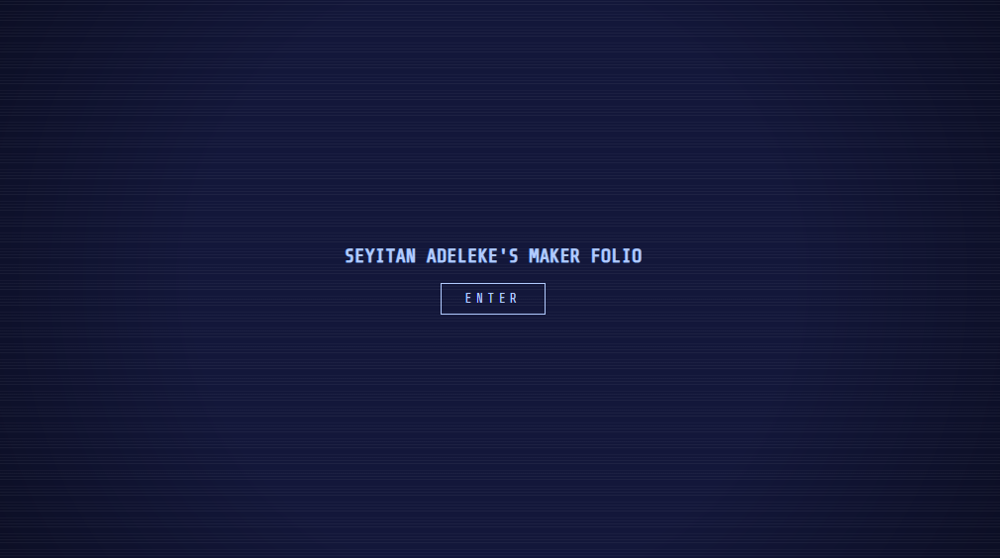
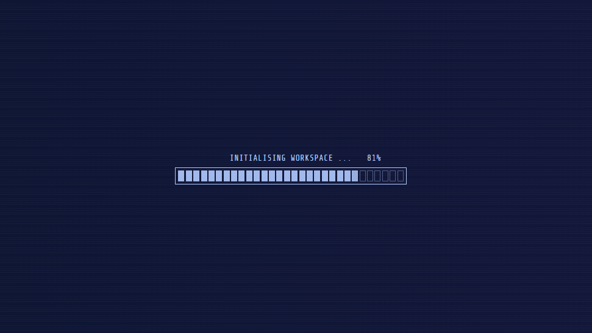
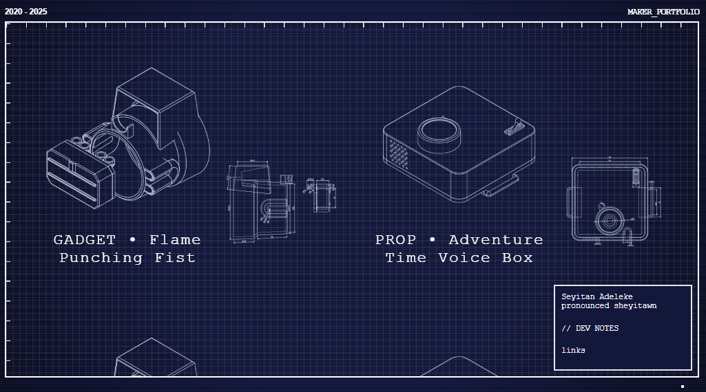

# MAKER_PORTFOLIO [WORK IN PROGRESS]

An interactive portfolio experience built with React and Three.js.  
This site showcases all my projects with (semi-)detailed descriptions of how they were made.




## Getting Started

```bash
git clone https://github.com/sheyitawn/maker-folio.git
cd maker-folio
npm install


npm run move-content
npm run update-projects
or 
npm run refresh


npm start
```

remember to change package.json to sync w/ obsidian file

## Lisence
MIT © sheyitawn

don't steal my portfolio pwetty pwease
